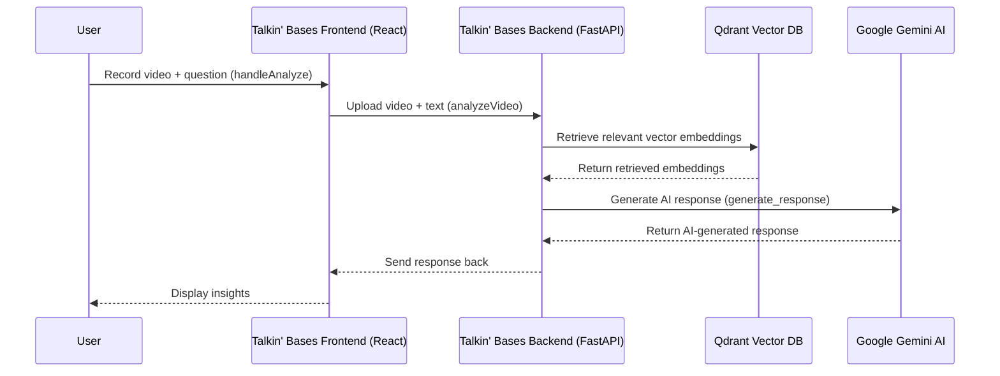

# Talkin' Bases: A Baseball AI Analysis System

## Overview
Talkin' Bases is an AI-powered baseball analysis system that captures user questions, processes them through a Retrieval-Augmented Generation (RAG) backend, and provides insightful responses using **Google Gemini Flash 1.5**. The system integrates:

- **Frontend (React.js)**: Captures video and audio input from users.
- **Backend (FastAPI & LlamaIndex)**: Processes requests and retrieves contextual information from **Qdrant vector database**.
- **Qdrant Data Ingestion Service**: Manages structured JSON baseball-related data, embedding it into Qdrant for efficient retrieval.
- **Google Cloud Run Deployment**: Scales the services on demand.

## Features
- Real-time video and audio capture.
- Speech-to-text conversion for user queries.
- Retrieval-Augmented Generation (RAG) for intelligent baseball insights.
- High-performance vector database (Qdrant) for contextual retrieval.
- Integration with **Google Gemini Flash 1.5** for AI-powered responses.
- Cloud-native deployment on **Google Cloud Run**.

---

## System Architecture

### **1. Frontend** (React.js - `talkin-bases-fe`)
- **Captures user video/audio** and converts speech to text.
- **Sends video & text input** to backend for processing.
- **Displays AI-generated responses** from backend.
- Deployed as **talkin-bases-fe** on Google Cloud Run.

### **2. Backend** (FastAPI - `talkin-bases`)
- **Handles API requests** from the frontend.
- **Retrieves context** from Qdrant database.
- **Uses Google Gemini Flash 1.5** to generate AI responses.
- Deployed as **talkin-bases** on Google Cloud Run.

### **3. Qdrant Data Service** (Python - `qdrant_embedding_project`)
- **Processes structured JSON baseball data** (player details, live feeds, rosters, schedules).
- **Generates embeddings** using **Gemini Embeddings**.
- **Stores embeddings** in Qdrant for similarity search.

---

## Deployment
### **1. Frontend (React.js)**
```bash
docker build -t gcr.io/your-project-id/talkin-bases-fe .
docker push gcr.io/your-project-id/talkin-bases-fe

gcloud run deploy talkin-bases-fe   --image gcr.io/your-project-id/talkin-bases-fe   --platform managed   --allow-unauthenticated   --region your-region
```

### **2. Backend (FastAPI)**
```bash
docker build -t gcr.io/your-project-id/talkin-bases .
docker push gcr.io/your-project-id/talkin-bases

gcloud run deploy talkin-bases   --image gcr.io/your-project-id/talkin-bases   --platform managed   --allow-unauthenticated   --region your-region
```

### **3. Qdrant Data Service**
```bash
docker build -t gcr.io/your-project-id/qdrant-embedding .
docker push gcr.io/your-project-id/qdrant-embedding

gcloud run deploy qdrant-embedding   --image gcr.io/your-project-id/qdrant-embedding   --platform managed   --allow-unauthenticated   --region your-region
```

---

## UML Sequence Diagram


---

## API Endpoints
### **Frontend → Backend**
- `POST /api/video_analysis`: Sends user question & video data for processing.

### **Backend → Qdrant**
- Fetches context vectors from stored baseball data.

### **Backend → Google Gemini Flash 1.5**
- Queries AI model for generating responses.

---

## Conclusion
This project provides a cloud-scalable **AI-powered baseball analysis** platform, integrating **video/audio capture, vector search, and generative AI** into a seamless user experience.
