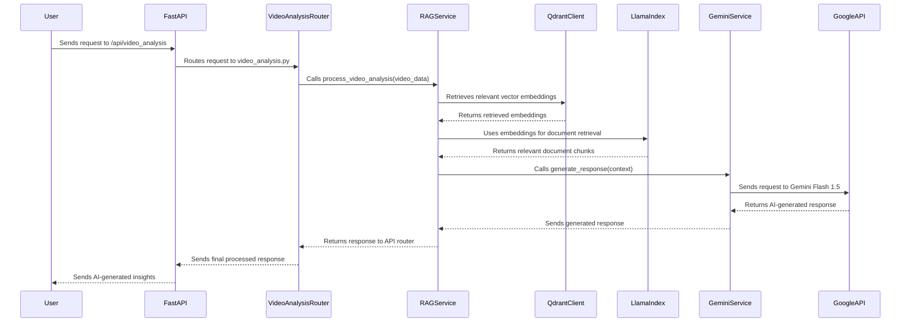

# Talkin Bases Backend with FastAPI, LlamaIndex, Qdrant, and Gemini Flash 1.5

## Overview
This project is a backend service implementing a **Retrieval-Augmented Generation (RAG)** system. The application uses **FastAPI** as the web framework and integrates **Qdrant** for vector embeddings storage, **LlamaIndex** for document indexing, and **Google Gemini Flash 1.5** for generative AI capabilities. The backend service is deployed on **Google Cloud Run**.

## Features
- **FastAPI-based RESTful API** for interacting with the RAG pipeline.
- **Qdrant Vector Database** for storing and retrieving embeddings.
- **LlamaIndex** for document ingestion, indexing, and querying.
- **Google Gemini Flash 1.5** for AI-powered responses.
- **Google API Integration** for secure communication with Google services.
- **Dockerized & Deployed on Google Cloud Run** for scalable, serverless execution.

## Project Structure
```
app/
│-- main.py                      # Entry point of FastAPI application
│-- requirements.txt             # List of required Python packages
│-- core/
│   ├── config.py                # Configuration settings (API keys, environment variables)
│   ├── __init__.py
│-- api/
│   ├── routes/
│   │   ├── video_analysis.py    # API route implementation
│   │   ├── __init__.py
│-- services/
│   ├── gemini_service.py        # Google Gemini model interactions
│   ├── rag_service.py           # RAG logic using Qdrant & LlamaIndex
│   ├── __init__.py
```

## Dependencies
The application requires the following Python packages, listed in `requirements.txt`:

```txt
fastapi
uvicorn
python-multipart
python-dotenv
llama-index
qdrant-client
google-generativeai
llama-index-embeddings-gemini
llama-index-multi-modal-llms-gemini
```
## UML Sequence Diagram



### Installing Dependencies
Run the following command to install dependencies:
```bash
pip install -r requirements.txt
```

## Application Logic
### 1. **FastAPI Setup (`main.py`)**
- Initializes the FastAPI app with CORS middleware.
- Registers API routes (e.g., `/api/video_analysis`).

### 2. **Configuration (`core/config.py`)**
- Loads environment variables from `.env`.
- Stores API keys (e.g., `GOOGLE_API_KEY`).

### 3. **Retrieval-Augmented Generation (`services/rag_service.py`)**
- Connects to **Qdrant** as the vector database.
- Uses **LlamaIndex** to generate vector embeddings and retrieve relevant data.
- Calls **Google Gemini Flash 1.5** for AI-enhanced response generation.

### 4. **Google Gemini AI Integration (`services/gemini_service.py`)**
- Manages API calls to **Google Generative AI**.
- Processes text and multimodal data using **Gemini Flash 1.5**.

## Deployment on Google Cloud Run
### 1. **Build & Push Docker Image**
Create a `Dockerfile` and build the container:
```bash
docker build -t gcr.io/your-project-id/backend-service .
docker push gcr.io/your-project-id/backend-service
```

### 2. **Deploy to Cloud Run**
```bash
gcloud run deploy backend-service   --image gcr.io/your-project-id/backend-service   --platform managed   --allow-unauthenticated   --region your-region
```

### 3. **Access the API**
Find the deployed URL using:
```bash
gcloud run services describe backend-service --region your-region
```

## API Endpoints
### 1. **Video Analysis API**
- Endpoint: `POST /api/video_analysis`
- Description: Processes video data and retrieves AI-generated insights.

## Conclusion
This project serves as a backend service for AI-powered retrieval and generation, leveraging modern cloud-based ML infrastructure. It is optimized for **scalability**, **fast responses**, and **integration with Google Cloud**.
